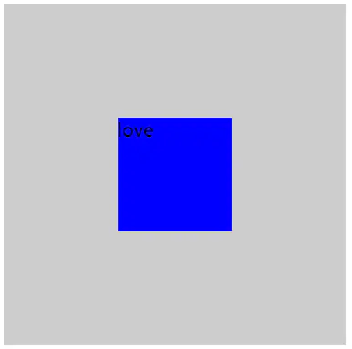
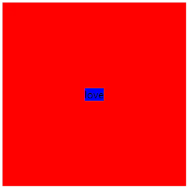
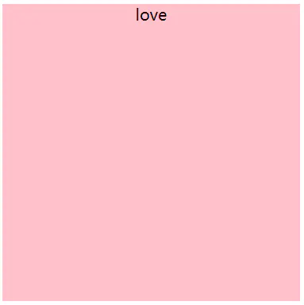

> 1、flex 布局实现 （元素已知宽度）

效果图：



```css
/*css代码*/
.box {
    height: 300px;
    width: 300px;
    background-color: #ccc;
    display: flex;
    display: -webkit-flex;
    justify-content: center;
    align-items: center;
}

.box .content {
    height: 100px;
    width: 100px;
    background-color: blue;
}

/*html代码*/
<div class="box">
    <div class="content">love</div>
</div>
```

> 2、position （元素已知宽度）

效果图：


```css
/*css代码*/
.box {
    height: 300px;
    width: 300px;
    background-color: #ccc;
    position: relative;
}

.box .content {
    height: 100px;
    width: 100px;
    background-color: blue;
    position: absolute;
    top: 50%;
    left: 50%;
    margin: -50px 0 0 -50px;
}

/*html代码*/
<div class="box">
    <div class="content">love</div>
</div>
```

> 3、position transform （元素未知宽度）

效果图：



```css
/*css代码*/
.box {
    height: 300px;
    width: 300px;
    background-color: red;
    position: relative;
}

.box .content {
    background-color: blue;
    position: absolute;
    top: 50%;
    left: 50%;
    transform: translate(-50%, -50%);
}

/*html代码*/
<div class="box">
    <div class="content">love</div>
</div>
```

> 4、position（元素已知宽度）（left，right，top，bottom为0，maigin：auto ）

效果图：


```css
/*css代码*/
.box {
    height: 300px;
    width: 300px;
    background-color: #ccc;
    position: relative;
}

.box .content {
    height: 100px;
    width: 100px;
    background-color: blue;
    position: absolute;
    top: 0;
    bottom: 0;
    left: 0;
    right: 0;
    margin: auto;
}

/*html代码*/
<div class="box">
    <div class="content">love</div>
</div>
```

> 4-1、如果子元素不设置宽度和高度，将会铺满整个父级（应用：模态框）

效果图：



```css
/*css代码*/
.box {
    height: 300px;
    width: 300px;
    background-color: #ccc;
    position: relative;
}

.box .content {
    /* 如果不设置宽高，将铺满整个父级*/
    background-color: pink;
    position: absolute;
    top: 0;
    bottom: 0;
    left: 0;
    right: 0;
    margin: auto;
}

/*html代码*/
<div class="box">
    <div class="content">love</div>
</div>
```

> 5、table-cell 布局实现

效果图：


```css
/*css代码*/
.box {
    width: 300px;
    height: 300px;
    background-color: red;
    display: table-cell;
    vertical-align: middle;
}

.box .content {
    margin-left: 100px;
    width: 100px;
    height: 100px;
    background-color: blue;
}

/*html代码*/
<div class="box">
    <div class="content">love</div>
</div>
```