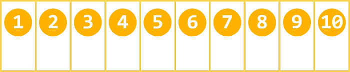
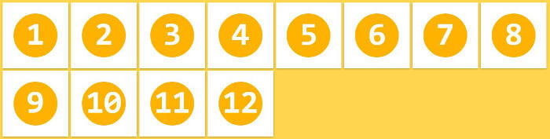
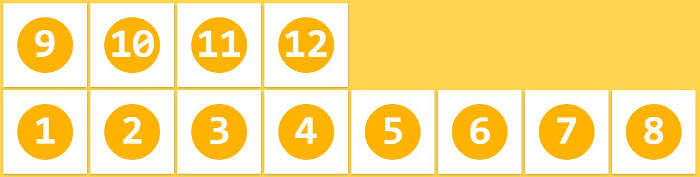
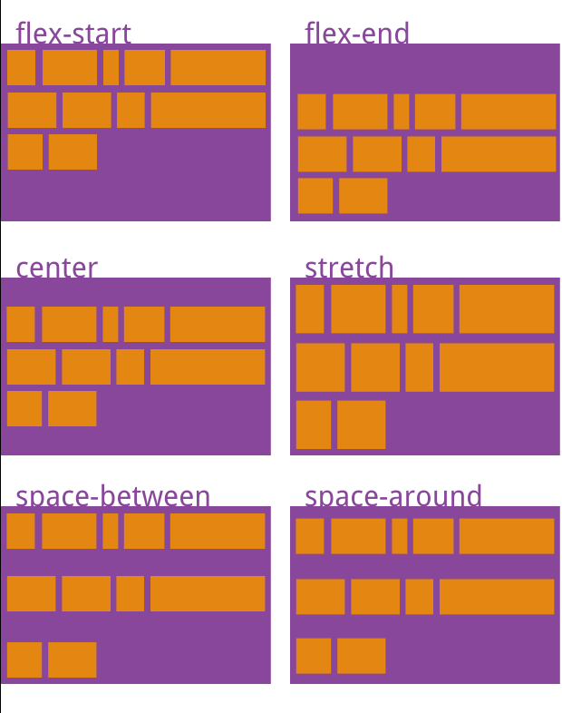

## flex属性

以下6个属性设置在容器上
- flex-direction 主轴
- flex-wrap  换行
- flex-flow flex-direction + flex-wrap 组合的语法
- justify-content
- align-items
- align-content 布局物体的整体进行布局

以下6个属性设置在项目上
- order 定义项目的排列顺序。数值越小，排列越靠前，默认为0
- flex-grow 定义项目的放大比例，默认为0，即如果存在剩余空间，也不放大
- flex-shrink 定义了项目的缩小比例，默认为1，即如果空间不足，该项目将缩小
- flex-basis 项目占据的主轴空间
- flex  是flex-grow, flex-shrink 和 flex-basis的简写
- align-self 允许单个项目有与其他项目不一样的对齐方式

## flex-direction


```css
.box {
    flex-direction: column | column-reverse | row | row-reverse;
}

column：主轴为垂直方向，起点在上沿。

column-reverse：主轴为垂直方向，起点在下沿。

row（默认值）：主轴为水平方向，起点在左端。

row-reverse：主轴为水平方向，起点在右端。
```

## flex-wrap

```css
.box{
    flex-wrap: nowrap | wrap | wrap-reverse;
}
```
（1）nowrap（默认）：不换行。

（2）wrap：换行，第一行在上方。

（3）wrap-reverse：换行，第一行在下方。


## flex-flow

flex-flow认为是一个 flex-direction + flex-wrap 组合的语法

```css
.box {
    flex-flow: <flex-direction> || <flex-wrap>;
}

默认值为row nowrap
```

## justify-content


```css
.box {
  justify-content: flex-start | flex-end | center | space-between | space-around;
}

flex-start（默认值）：左对齐

flex-end：右对齐

center： 居中

space-between：两端对齐，项目之间的间隔都相等。

space-around：每个项目两侧的间隔相等。所以，项目之间的间隔比项目与边框的间隔大一倍。
```

## align-items

布局的时候针对布局的内容部分


```css
.box {
  align-items: flex-start | flex-end | center | baseline | stretch;
}

flex-start：交叉轴的起点对齐。

flex-end：交叉轴的终点对齐。

center：交叉轴的中点对齐。

baseline: 项目的第一行文字的基线对齐。

stretch（默认值）：如果项目未设置高度或设为auto，将占满整个容器的高度。
```

## align-content

布局的时候针对布局物体的整体进行布局



```css
.box {
  align-content: flex-start | flex-end | center | space-between | space-around | stretch;
}

flex-start：与交叉轴的起点对齐。

flex-end：与交叉轴的终点对齐。

center：与交叉轴的中点对齐。

space-between：与交叉轴两端对齐，轴线之间的间隔平均分布。

space-around：每根轴线两侧的间隔都相等。所以，轴线之间的间隔比轴线与边框的间隔大一倍。

stretch（默认值）：轴线占满整个交叉轴。
```

## order

order属性定义项目的排列顺序。数值越小，排列越靠前，默认为0。

```css
.item {
  order: <integer>;
}
```


## flex-grow

flex-grow属性定义项目的放大比例，默认为0，即如果存在剩余空间，也不放大。

```css
.item {
  flex-grow: <number>; /* default 0 */
}

如果所有项目的flex-grow属性都为1，则它们将等分剩余空间（如果有的话）。如果一个项目的flex-grow属性为2，其他项目都为1，则前者占据的剩余空间将比其他项多一倍。
```


## flex-shrink

flex-shrink属性定义了项目的缩小比例，默认为1，即如果空间不足，该项目将缩小。

```css
.item {
  flex-shrink: <number>; /* default 1 */
}

如果所有项目的flex-shrink属性都为1，当空间不足时，都将等比例缩小。如果一个项目的flex-shrink属性为0，其他项目都为1，则空间不足时，前者不缩小。

负值对该属性无效。
```


## flex-basis

flex-basis属性定义了在分配多余空间之前，项目占据的主轴空间（main size）

```css
.item {
  flex-basis: <length> | auto; /* default auto */
}

它的默认值为auto，即项目的本来大小

它可以设为跟width或height属性一样的值（比如350px），则项目将占据固定空间
```

## flex

flex属性是flex-grow, flex-shrink 和 flex-basis的简写，默认值为0 1 auto。后两个属性可选。

```css
.item {
  flex: none | [ <'flex-grow'> <'flex-shrink'>? || <'flex-basis'> ]
}

该属性有两个快捷值：auto (1 1 auto) 和 none (0 0 auto)。

建议优先使用这个属性，而不是单独写三个分离的属性，因为浏览器会推算相关值。
```

## align-self

align-self属性允许单个项目有与其他项目不一样的对齐方式，可覆盖align-items属性。默认值为auto，表示继承父元素的align-items属性，如果没有父元素，则等同于stretch

```css
.item {
  align-self: auto | flex-start | flex-end | center | baseline | stretch;
}

该属性可能取6个值，除了auto，其他都与align-items属性完全一致。
```


## 参考链接

https://www.zhangxinxu.com/wordpress/2018/10/display-flex-css3-css/


