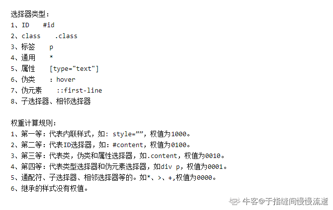

> 1.介绍一下标准的CSS的盒子模型？与低版本IE的盒子模型有什么不同的？

标准盒子模型：宽度=内容的宽度（content）+ border + padding + margin

低版本IE盒子模型：宽度=内容宽度（content+border+padding）+ margin

> 2.box-sizing属性？

用来控制元素的盒子模型的解析模式，默认为content-box

context-box：W3C的标准盒子模型，设置元素的 height/width 属性指的是content部分的高/宽

border-box：IE传统盒子模型。设置元素的height/width属性指的是border + padding + content部分的高/宽

> 3.CSS选择器有哪些?

通配符选择器（*）

id选择器(#myid)

类选择器(.myclassname)

标签选择器(div, h1, p)

相邻选择器(h1 + p)

子选择器（ul > li）

后代选择器（li a）

属性选择器（a[rel="external"]）

伪类选择器（a:hover, li:nth-child）

> 4.css优先级（就近原则）

!important > 内联(1,0,0,0) > id: (0,1,0,0) > 类：(0,0,1,0) > 伪类/属性 > 元素：(0,0,0,1) > 通配符

- !important声明的样式优先级最高，如果冲突再进行计算。
- 如果优先级相同，则选择最后出现的样式。
- 继承得到的样式的优先级最低。



> 5.一个满屏品字布局如何设计

- 第一种真正的品字：

三块高宽是确定的；

上面那块用margin: 0 auto;居中；

下面两块用float或者inline-block不换行；

用margin调整位置使他们居中。

- 第二种全屏的品字布局:

上面的div设置成100%，下面的div分别宽50%，然后使用float或者inline使其不换行。

> 6.常见的兼容性问题

1.不同浏览器的标签默认的margin和padding不一样。

```css
*{
    margin:0;padding:0;
}
```

2.IE6双边距bug：块属性标签float后，又有横行的margin情况下，在IE6显示margin比设置的大。hack：display:inline;将其转化为行内属性。

3.渐进识别的方式，从总体中逐渐排除局部。首先，巧妙的使用“9”这一标记，将IE浏览器从所有情况中分离出来。接着，再次使用“+”将IE8和IE7、IE6分离开来，这样IE8已经独立识别。

```css
{
    background-color:#f1ee18;/*所有识别*/
    .background-color:#00deff\9; /*IE6、7、8识别*/
    +background-color:#a200ff;/*IE6、7识别*/
    _background-color:#1e0bd1;/*IE6识别*/
}
```

4.设置较小高度标签（一般小于10px），在IE6，IE7中高度超出自己设置高度。hack：给超出高度的标签设置overflow:hidden;或者设置行高line-height 小于你设置的高度。

5.IE下，可以使用获取常规属性的方法来获取自定义属性,也可以使用getAttribute()获取自定义属性；Firefox下，只能使用getAttribute()获取自定义属性。解决方法:统一通过getAttribute()获取自定义属性。

6.Chrome 中文界面下默认会将小于 12px 的文本强制按照 12px 显示,可通过加入 CSS 属性 -webkit-text-size-adjust: none; 解决。

7.超链接访问过后hover样式就不出现了，被点击访问过的超链接样式不再具有hover和active了。解决方法是改变CSS属性的排列顺序:L-V-H-A ( love hate ): a:link {} a:visited {} a:hover {} a:active {}

> 7.为什么会出现浮动和什么时候需要清除浮动？清除浮动的方式？

浮动元素碰到包含它的边框或者浮动元素的边框停留。由于浮动元素不在文档流中，所以文档流的块框表现得就像浮动框不存在一样。浮动元素会漂浮在文档流的块框上。

- 浮动带来的问题：

        父元素的高度无法被撑开，影响与父元素同级的元素
        
        与浮动元素同级的非浮动元素（内联元素）会跟随其后
        
        若非第一个元素浮动，则该元素之前的元素也需要浮动，否则会影响页面显示的结构。

- 清除浮动的方式：

        父级div定义height
        
        最后一个浮动元素后加空div标签 并添加样式clear:both。
        
        包含浮动元素的父标签添加样式overflow为hidden或auto。
        
        父级div定义zoom

> 8.移动端的布局用过媒体查询吗？

通过媒体查询可以为不同大小和尺寸的媒体定义不同的css，适应相应的设备的显示。

```css
<head>里边
<link rel="stylesheet" type="text/css" href="xxx.css" media="only screen and (max-device-width:480px)">
```

```css
CSS : @media only screen and (max-device-width:480px) {/css样式/}
```

> 9.position属性

◆position:static　无定位

该属性值是所有元素定位的默认情况，在一般情况下，我们不需要特别的去声明它，但有时候遇到继承的情况，我们不愿意见到元素所继承的属性影响本身，从而可以用position:static取消继承（覆盖继承），即还原元素定位的默认值。


◆position:absolute　绝对定位

使用position:absolute，能够很准确的将元素移动到你想要的位置，


◆position:fixed　相对于窗口的固定定位

这个定位属性值是什么意思呢？元素的定位方式同absolute类似，但它的包含块是视区本身。在屏幕媒体如WEB浏览器中，元素在文档滚动时不会在浏览器视察中移动。例如，它允许框架样式布局。在页式媒体如打印输出中，一个固定元素会出现于第一页的相同位置。这一点可用于生成流动标题或脚注。我们也见过相似的效果，但大都数效果不是通过CSS来实现了，而是应用了JS脚本。
请特别注意，IE6不支持CSS中的position:fixed属性。真的非常遗憾，要不然我们就可以试试这种酷酷的效果了。

◆position:relative　相对定位

所谓相对定位到底是什么意思呢，是基于哪里的相对呢？我们需要明确一个概念，相对定位是相对于元素默认的位置的定位。既然是相对的，我们就需要设置不同的值来声明定位在哪里，top、bottom、left、right四个数值配合，来明确元素的位置。

> 10.visibility: hidden; display: none; opacity: 0; 之间的区别

{ display: none; /* 不占据空间，无法点击 / }

{ visibility: hidden; / 占据空间，无法点击 / }

{ opacity: 0;  / 占据空间，可以点击 / }
