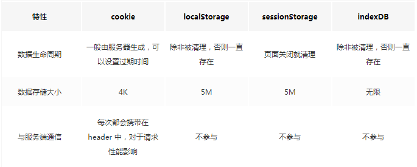
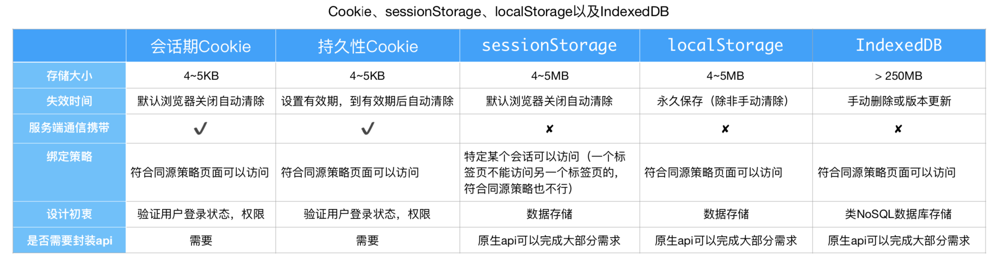
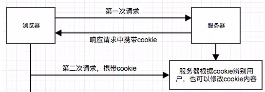
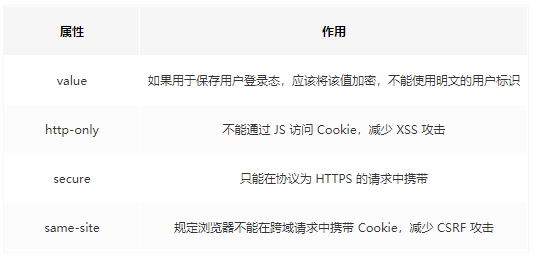
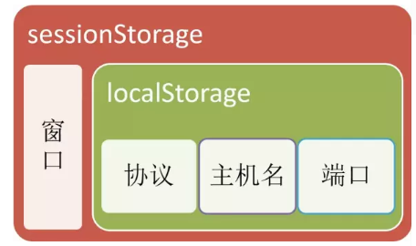
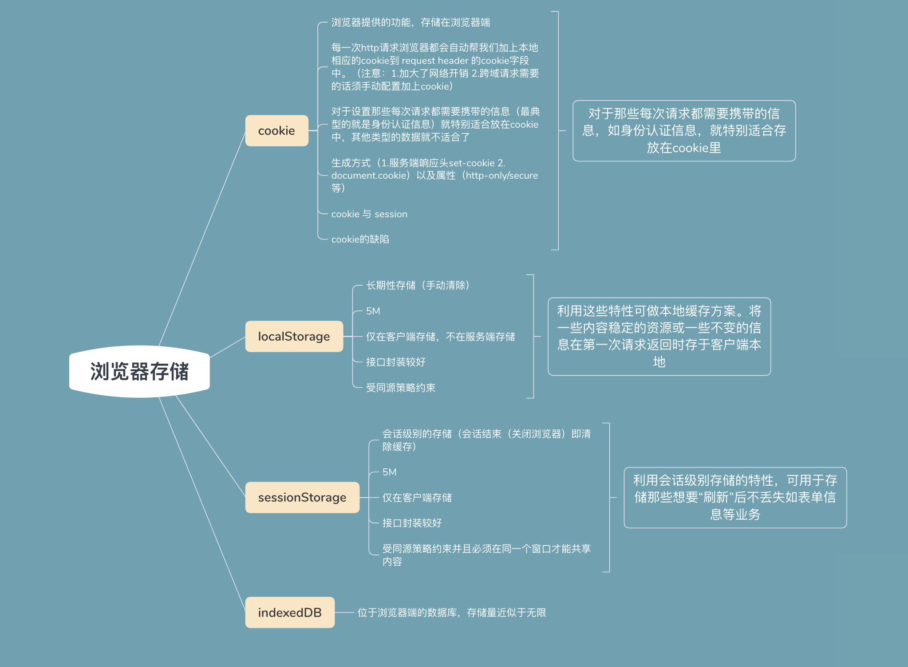

## 浏览器存储之 Cookie、sessionStorage、localStorage、IndexedDB





### Cookie

> 大小： 4kb

> 来源：服务端生成、客户端进行维护和存储

> 生成原理



第一次访问网站的时候，浏览器发出请求，服务器响应请求后，会在响应头里面添加一个Set-Cookie选项，将cookie放入到响应请求中，在浏览器第二次发请求的时候，会通过Cookie请求头部将Cookie信息发送给服务器，服务端会辨别用户身份，另外，Cookie的过期时间、域、路径、有效期、适用站点都可以根据需要来指定。

> 生成方式

- 生成方式一：http response header中的set-cookie

我们可以通过响应头里的 Set-Cookie 指定要存储的 Cookie 值。默认情况下，domain 被设置为设置 Cookie 页面的主机名，我们也可以手动设置 domain 的值。

```javascript
Set - Cookie
:
id = a3fWa;
Expires = Wed, 21
Oct
2018
07
:
28
:
00
GMT;//可以指定一个特定的过期时间（Expires）或有效期（Max-Age）
```

当Cookie的过期时间被设定时，设定的日期和时间只与客户端相关，而不是服务端。

- 生成方式二：js中可以通过document.cookie可以读写cookie，以键值对的形式展示

```javascript
document.cookie = "userName=hello"
document.cookie = "gender=male"
document.cookie = 'age=20;domain=.baidu.com'
```

Domain 标识指定了哪些域名可以接受Cookie。如果没有设置domain，就会自动绑定到执行语句的当前域。
如果设置为”.baidu.com”,则所有以”baidu.com”结尾的域名都可以访问该Cookie，所以在掘金社区上读取不到第三条代码存储Cookie值。

> 安全



> 典型的应用场景

- 记住密码，下次自动登录。

- 购物车功能。

- 记录用户浏览数据，进行商品（广告）推荐。

### localStorage

> 大小：4mb

> 来源：本地生成通过key-value的方式

> 特点

- 保存的数据长期存在，下一次访问该网站的时候，网页可以直接读取以前保存的数据。
- 大小为5M左右
- 仅在客户端使用，不和服务端进行通信
- 接口封装较好

> 存入/读取数据

- ocalStorage保存的数据，以“键值对”的形式存在。也就是说，每一项数据都有一个键名和对应的值。所有的数据都是以文本格式保存。
- 存入数据使用setItem方法。它接受两个参数，第一个是键名，第二个是保存的数据。

```javascript
localStorage.setItem("key", "value");
```

- 读取数据使用getItem方法。它只有一个参数，就是键名。

```javascript
var valueLocal = localStorage.getItem("key");
```

> 使用场景

LocalStorage在存储方面没有什么特别的限制，理论上 Cookie 无法胜任的、可以用简单的键值对来存取的数据存储任务，都可以交给 LocalStorage 来做，存储一些内容稳定的资源。

### sessionStorage

> 大小：4mb

> 特点

- 会话级别的浏览器存储
- 大小为5M左右
- 仅在客户端使用，不和服务端进行通信
- 接口封装较好

基于上面的特点，sessionStorage 可以有效对表单信息进行维护，比如刷新时，表单信息不丢失。

> 使用场景

sessionStorage 更适合用来存储生命周期和它同步的会话级别的信息。这些信息只适用于当前会话，当你开启新的会话时，它也需要相应的更新或释放。比如微博的 sessionStorage就主要是存储你本次会话的浏览足迹

### sessionStorage 、localStorage 和 cookie 之间的区别

- 共同点：都是保存在浏览器端，且都遵循同源策略。
- 不同点：在于生命周期与作用域的不同

作用域：localStorage只要在相同的协议、相同的主机名、相同的端口下，就能读取/修改到同一份localStorage数据。sessionStorage比localStorage更严苛一点，除了协议、主机名、端口外，还要求在同一窗口（也就是浏览器的标签页）下



生命周期：localStorage 是持久化的本地存储，存储在其中的数据是永远不会过期的，使其消失的唯一办法是手动删除；而 sessionStorage
是临时性的本地存储，它是会话级别的存储，当会话结束（页面被关闭）时，存储内容也随之被释放。

Web Storage 是一个从定义到使用都非常简单的东西。它使用键值对的形式进行存储，这种模式有点类似于对象，却甚至连对象都不是——它只能存储字符串，要想得到对象，我们还需要先对字符串进行一轮解析。

说到底，Web Storage 是对 Cookie 的拓展，它只能用于存储少量的简单数据。当遇到大规模的、结构复杂的数据时，Web Storage 也爱莫能助了。这时候我们就要清楚我们的终极大 boss——IndexedDB！

### IndexedDB

IndexedDB 是一种低级API，用于客户端存储大量结构化数据(包括文件和blobs)。该API使用索引来实现对该数据的高性能搜索。IndexedDB 是一个运行在浏览器上的非关系型数据库。既然是数据库了，那就不是 5M、10M
这样小打小闹级别了。理论上来说，IndexedDB 是没有存储上限的（一般来说不会小于 250M）。它不仅可以存储字符串，还可以存储二进制数据。

> 1.IndexedDB的特点 键值对储存。 IndexedDB 内部采用对象仓库（object store）存放数据。所有类型的数据都可以直接存入，包括 JavaScript 对象。对象仓库中，数据以"键值对"
的形式保存，每一个数据记录都有对应的主键，主键是独一无二的，不能有重复，否则会抛出一个错误。

- 异步 IndexedDB 操作时不会锁死浏览器，用户依然可以进行其他操作，这与 LocalStorage 形成对比，后者的操作是同步的。异步设计是为了防止大量数据的读写，拖慢网页的表现。

- 支持事务。 
  
IndexedDB 支持事务（transaction），这意味着一系列操作步骤之中，只要有一步失败，整个事务就都取消，数据库回滚到事务发生之前的状态，不存在只改写一部分数据的情况。

同源限制 IndexedDB 受到同源限制，每一个数据库对应创建它的域名。网页只能访问自身域名下的数据库，而不能访问跨域的数据库。

储存空间大 IndexedDB 的储存空间比 LocalStorage 大得多，一般来说不少于 250MB，甚至没有上限。

- 支持二进制储存。 
  
IndexedDB 不仅可以储存字符串，还可以储存二进制数据（ArrayBuffer 对象和 Blob 对象）。

> 2.IndexedDB的常见操作 在IndexedDB大部分操作并不是我们常用的调用方法，返回结果的模式，而是请求——响应的模式。

建立打开IndexedDB ----window.indexedDB.open("testDB")
这条指令并不会返回一个DB对象的句柄，我们得到的是一个IDBOpenDBRequest对象，而我们希望得到的DB对象在其result属性中

除了result，IDBOpenDBRequest接口定义了几个重要属性:

- onerror: 请求失败的回调函数句柄
- onsuccess:请求成功的回调函数句柄
- onupgradeneeded:请求数据库版本变化句柄

```javascript
<script>
    function openDB(name){
        var request=window.indexedDB.open(name)//建立打开IndexedDB
        request.onerror=function (e){
            console.log('open indexdb error')
        }
        request.onsuccess=function (e){
            myDB.db=e.target.result//这是一个 IDBDatabase对象，这就是IndexedDB对象
            console.log(myDB.db)//此处就可以获取到db实例
        }
    }
    var myDB={
        name:'testDB',
        version:'1',
        db:null
    }
    openDB(myDB.name)
</script>
```

控制台得到一个 IDBDatabase对象，这就是IndexedDB对象

```javascript
关闭IndexedDB--
--indexdb.close()

function closeDB(db) {
    db.close();
}

删除IndexedDB--
--window.indexedDB.deleteDatabase(indexdb)

function deleteDB(name) {
    indexedDB.deleteDatabase(name)
}
```

### 总结

- Cookie 的本职工作并非本地存储，而是“维持状态”
- Web Storage 是 HTML5 专门为浏览器存储而提供的数据存储机制，不与服务端发生通信
- IndexedDB 用于客户端存储大量结构化数据



### 参考资料

https://github.com/ljianshu/Blog/issues/25

https://github.com/YxrSadhu/Article/issues/18