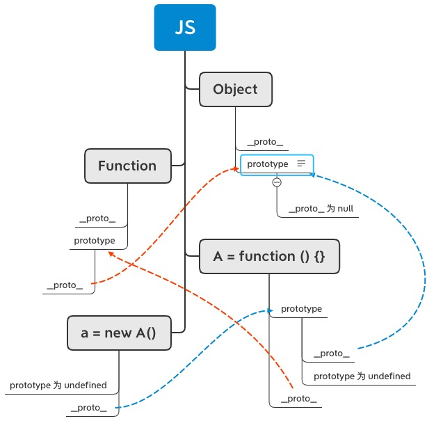
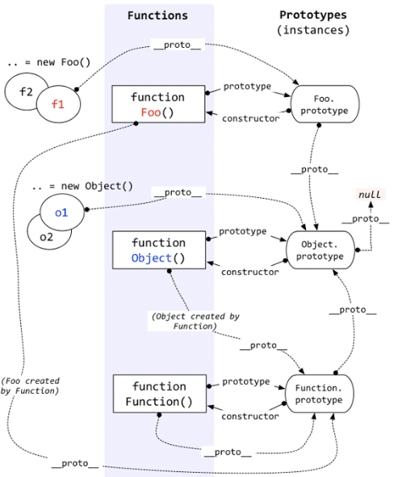

## 明确什么是构造函数、实例对象、实例原型
function Person() {

}
var person = new Person();
person.name = 'Kevin';
console.log(person.name) // Kevin

Person.prototype.name = 'Kevin';
var person1 = new Person();
var person2 = new Person();
console.log(person1.name) // Kevin
console.log(person2.name) // Kevin

构造函数：大Person
实例对象：小person
构造函数的prototype指向实例原型（用来储存公共内容）
实例原型有constructor指向构造函数（用来储存私有内容）

1、通过构造函数创建了一个实例对象
2、实例对象调用构造函数创建了实例原型
3、实例对象有一个‘__proto__’属性指向实例原型
4、每一个实例原型都有constructor属性指向构造函数

__proto__ 是浏览器支持的，不存在实例原型中。

xxx.__proto__  返回的东西其实就是 Object.getPrototypeOf(obj)方法返回的东西

## new 一个构造函数的时候发生的事情：
- 创建一个空的简单JavaScript对象/Objcect对象（即{}）；
- 链接该对象（即设置该对象的构造函数）到一个新的对象 ；
- 将步骤1新创建的对象作为this的上下文 ；
- 如果该函数没有返回对象，则返回this。

## 手动实现new的过程

function Create() {
    // 创建一个空的对象
    let _obj = new Object();
    // 获得构造函数
    let _con = [].shift.call(arguments);
    // 链接到原型
    _obj.__proto__ = _con.prototype;
    // 绑定 this，执行构造函数
    let _res = _obj.apply(_obj, arguments)
    // 确保 new 出来的是个对象
    return typeof _res == 'object' ? _res : _obj
}

## 参考连接

https://github.com/KieSun/Dream/issues/2

https://www.cnblogs.com/everlose/p/12930468.html

https://www.cnblogs.com/everlose/p/12944524.html