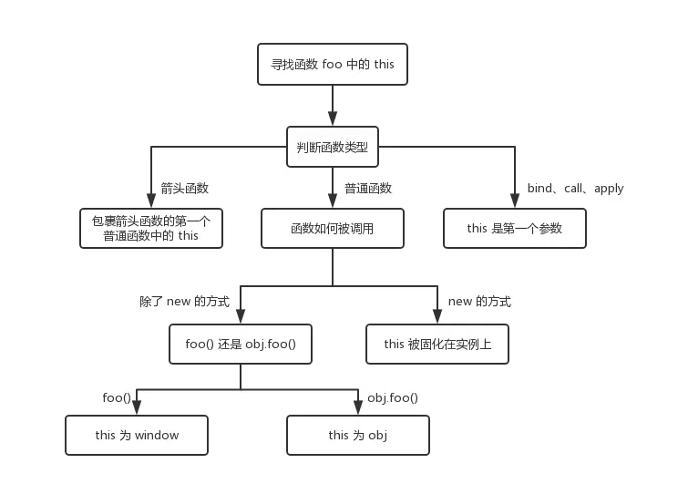

- 判断基础字类型 使用 typeof 🌰：console.log(typeof ’str')（除了 null 以外的其他基础类型均能判断【number、Boolean、string、undefined、】复杂引用数据类型也只能判断 Function 类型，(普通对象/数组对象/正则对象/日期对象)其他均为 Object，无法判断）typeof NaN === 'number'
- 判断复杂引用数据类型 使用 instanceof 🌰：console.log([] instanceof Array) 【Array、Function、Object】 底层机制：只要当前类出现在实例上的原型上结果都是 true
- 可以判断所有类型 使用 constructor 🌰： console.log((2).constructor) === Number）（但是如果创建一个对象更改原型 constructor 就不可靠了）
  function Fn (){}
  Fn.prototype = new Array(); // 将 Fn 的原型改成了数组
  var f = new Fn()
  console.log(f.constructor === Fn) // false
  console.log(f.constructor === Array) // true
- Object.prototype.toString.call() toString 是原型方法，调用方法，可以统一返回的格式为"[object, xxx]"字符串，其中的 xxx 就是对象类型，对于 object 对象可以直接调用（Object.prototype.toString({})），其他类型需要加.call 调用，才能返回正确类型信息 🌰： Object.prototype.toString.call('str') // "[object String]"
  // 全局通用的数据类型
  function getType(obj) {
  if(typeof obj !==='object') return typeof obj // 先判断基本类型
  Object.prototype.toString.call(obj).replace(/^\[object (\S+)\]$/, '$1') // 复杂类型使用 Object.prototype.toString.call()
  }
  使用 getType('str') // string

基本类型(null): 使用 String(null)
基本类型(string / number / boolean / undefined) + function: - 直接使用 typeof 即可
其余引用类型(Array / Date / RegExp Error): 调用 toString 后根据[object XXX]进行判断

/**\*\***\*\*\*\***\*\***\*\*\***\*\***\*\*\*\***\*\***this**\*\*\*\***\*\***\*\*\*\***\*\*\***\*\*\*\***\*\***\*\*\*\*** \*/

- call、apply、bind 可以手动修改 this 指向
  new 的方式优先级最高、其次是 bind、call、apply 最后是 obj.foo()这种调用方式，箭头函数的 this 一旦被绑定，就不会再被任何方式改变
  call、apply、bind 不管几次，this 永远由第一个参数决定 fn.bind(这个参数决定).bind(a)();
  

* call: fn.call(target, 1,2)
* applly: fn.apply(target, [1,2])
* bind : fn.bind(target)(1,2)
  

// 变量提升
在提升的过程中，相同的函数会覆盖上一个函数，并且函数优先于变量提升
🌰： b() // call b second
    function b() { console.log('call b fist') }
    function b() { console.log('call b second') }
    var b = 'Hello world'

// 执行上下文
执行js代码时，会产生三种执行上下文
* 全局执行上下文
* 函数执行上下文
* eval执行上下文
三种执行上下文中都有三个重要属性（变量对象、作用域链、this）
代码执行过程：
* 创建全局上下文（global EC）
* 全局执行上下文（caller）逐行 自上而下执行。遇到函数时，函数执行上下文（caller）被push到执行栈顶层
* 函数执行上下文被激活，成为active EC，开始执行函数中的代码，caller被挂起
* 函数执行完后，caller被pop移除执行栈，控制权交还全局上下文（caller）继续执行

// 作用域
作用域可理解为变量的可访问性，可分三种
* 全局作用域  挂载在window对象下的变量，所以在网页中的任何位置都可以使用并且访问到这个全局变量
* 函数作用域  在函数中定义的变量叫函数变量。只能在函数内部才能访问到它，所以它的作用域也就是函数的内部，称为函数作用域
* 块级作用域，ES6中的let、const 就可以产生该作用域 let 关键词定义的变量只能在块级作用域中被访问，有“暂时性死区”的特点，就是说在这个变量在定义之前是不能被使用的

// 闭包 本质就是当前环境中存在执行父级作用域的引用 TODO
