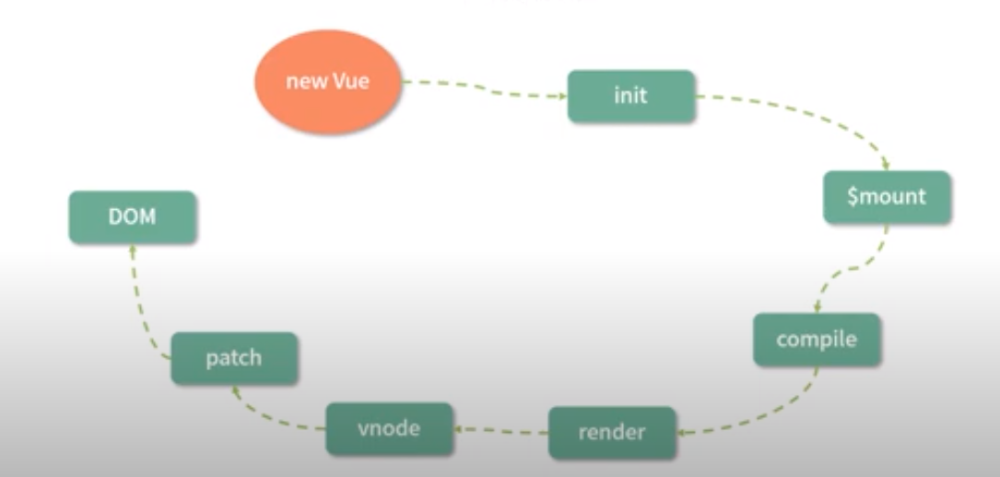

## vue实例化的过程

参考连接1：[vue实例化过程1](https://www.cnblogs.com/gerry2019/p/12001661.html)
参考连接2：[vue实例化过程2](https://vue3js.cn/interview/vue/new_vue.html)

### 过程解析

1、vue接受了一个参数option，option中包含了（挂载的目标el，数据data，组件components）。执行了在构造函数上的_init()方法。

2、_init（）方法中

    合并vue属性（得到合并后的data，type，function等）
    初始化proxy拦截器
    初始化组件生命周期标志符
    初始化组件事件侦听
    初始化渲染方法
    初始化依赖注入内容，在初始化data、props之前
    初始化props/data/method/watch/methods
    挂载元素

3、initState（）方法中

    对props, methods, data 和 watch 进行初始化

4、pushTarget/popTarget 中

    保证无论何时，执行的组件监听计算只有一个

    getData的返回值就是合并后的data对象，赋值到当前的实例属性。接下来有个while循环，里面主要做三件事：
    第一，判断我们声明的data变量的合法性，我们声明变量的名称一定不要与methods或者props中的属性名重复，这也是许多新手容易犯的错误
    第二，声明变量的时候，不要用以_或者$开头的变量，这些可能会导致声明变量和vue私有变量冲突
    第三，将data中的变量代理到vm（组件实例）上，按照this的指向性原理，data对象中的this应该指向data，而不应该指向vm，这里做了一层封装代理

5、observe初始化

    给data设置一个__ob__属性，并指向当前的实例
    如果是数组的话就重写数组方法转化为对象格式，然后设置为响应式对象
    如果是对象，则直接设置为响应式对象

6、defineReactive设置为响应式对象

    通过for循环对象的key.length，触发响应式定义对象的方法

    方法中包含了：
    初始化一个发布-订阅模型，每个对象都包含一个dep实例
    获取属性描述符
    判断对象的属性是否可扩展、可配置
    将值设置为可扩展、可配置
    并设置set和get方法
    set方法中用来给每个数据设置一个wathcher，并进行依赖收集
    get方法中用来获取新的数据并触发派发更新

7、 $mount

    解析template和挂载dom

    解析template的方法：
    1、将html文档片段解析成ast描述符
    2、将ast描述符解析成字符串
    3、生成render function

    挂载dom的方法：
    先添加新数据生成的节点，然后再移除老的节点

### 总结

    0、接收参数option，option中包含了（挂载的目标el，数据data，组件components）
    1、实例化属性进行合并
    2、初始化组件生命周期标志符 
    3、初始化组件事件系统
    4、初始化render方法（$arrt,$createElement）
    5、初始化组件依赖注入内容
    6、初始化state（对props, methods, data、computed 和 watch等方法进行初始化）保证无论何时，执行的组件监听计算只有一个
        
        6.1、响应式数据处理

            - 合并的data对象
            getData的返回值就是合并后的data对象，赋值到当前的实例属性。接下来有个while循环，里面主要做三件事：
            第一，判断我们声明的data变量的合法性，我们声明变量的名称一定不要与methods或者props中的属性名重复，这也是许多新手容易犯的错误
            第二，声明变量的时候，不要用以_或者$开头的变量，这些可能会导致声明变量和vue私有变量冲突
            第三，将data中的变量代理到vm（组件实例）上，按照this的指向性原理，data对象中的this应该指向data，而不应该指向vm，这里做了一层封装代理
        
            - observe初始化
            给data设置一个__ob__属性，并指向当前的实例
            如果是数组的话就重写数组方法转化为对象格式，然后设置为响应式对象
            如果是对象，则直接设置为响应式对象
            通过for循环对象的key.length，触发响应式定义对象的方法
        
            - defineReactive设置为响应式对象
            初始化一个发布-订阅模型，每个对象都包含一个dep实例
            获取属性描述符
            判断对象的属性是否可扩展、可配置
            将值设置为可扩展、可配置
            并设置set和get方法
            set方法中用来给每个数据设置一个wathcher，并进行依赖收集
            get方法中用来获取新的数据并触发派发更新

        6.2、初始化computed计算属性
        
        6.3、初始化watch

    7、解析template和挂载dom

        解析template的方法：
        1、将html文档片段解析成ast描述符
        2、将ast描述符解析成字符串
        3、生成render function
    
        挂载dom的方法：
        先添加新数据生成的节点，然后再移除老的节点

### 总结2

1、接收参数option，option中包含了（挂载的目标el，数据data，组件components）
2、调用_init（）方法将（生命周期标志位、组件事件侦听、props/data/method/watch/methods等方法）进行初始化
3、调用$mount进行页面的挂载
4、定义updateComponent更新函数
5、执行render生成虚拟DOM
6、_update将虚拟DOM生成真实DOM结构，并且渲染到页面中

### 总结3

监听数据
渲染页面
